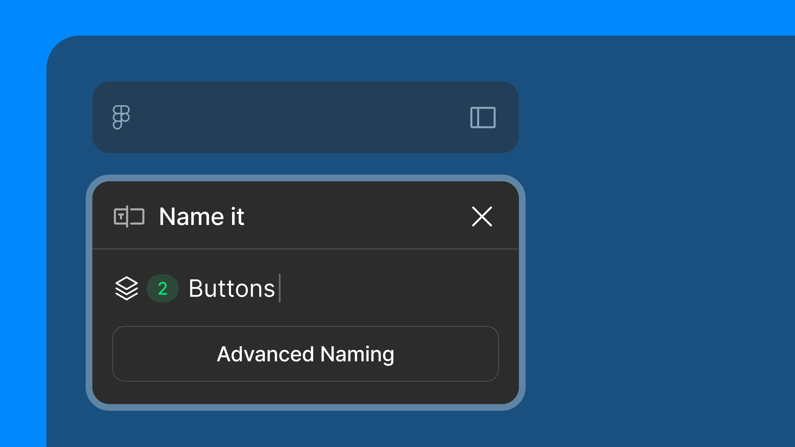
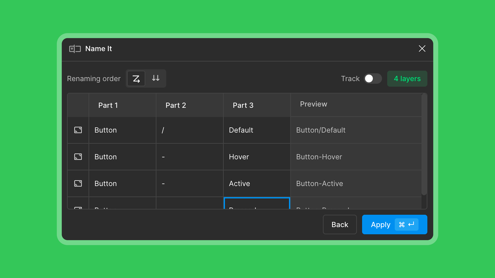
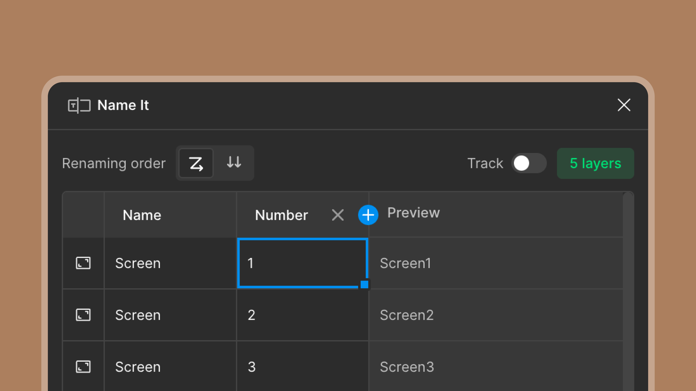

# Name It

A minimal Figma plugin for lightning-fast layer renaming. Skip the double-click and rename layers instantly.

<p align="center">
  
</p>

## Features

### Quick Mode
- **Live Rename** - See changes as you type, no need to hit save
- **Multi-select Support** - Rename multiple layers at once with the same name
- **Smart Layer Icons** - Visual indicator showing what type of layer you've selected (frame, text, image, shapes, components, etc.)
- **Keyboard Navigation** - Use Tab/Shift+Tab to quickly move between sibling layers
- **Zoom to Selection** - Click the layer icon to zoom to your selected layers

### Advanced Batch Mode

<p align="center">
  
</p>

- **Excel-like Grid** - Rename multiple layers with an intuitive spreadsheet interface
- **Smart Name Parsing** - Automatically splits names by separators (_, -, /), camelCase, and numbers
- **Direction Sorting** - Sort layers by reading order (Z) or reverse (N) pattern
- **Drag-to-Fill** - Select cells and drag to fill with series (1, 2, 3... or A, B, C...)
- **Column Management** - Add, delete, and rename columns to structure your naming convention
- **Live Preview** - See the final combined name before applying
- **Track Mode** - Toggle to auto-zoom to each layer as you select rows in the grid
- **Undo/Redo** - Full support for Cmd+Z and Cmd+Shift+Z

<p align="center">
  
</p>

## Keyboard Shortcuts

### Quick Mode
| Key | Action |
|-----|--------|
| `Tab` | Jump to next sibling layer |
| `Shift + Tab` | Jump to previous sibling layer |
| `Enter` | Enter into frame (select children) |

### Advanced Batch Mode
| Key | Action |
|-----|--------|
| `Tab` | Move to next cell |
| `Shift + Tab` | Move to previous cell |
| `Enter` | Move down to next row |
| `Arrow Keys` | Navigate between cells |
| `Shift + Arrow` | Extend selection |
| `Cmd/Ctrl + A` | Select all cells |
| `Cmd/Ctrl + C` | Copy selected cells |
| `Cmd/Ctrl + V` | Paste cells |
| `Cmd/Ctrl + X` | Cut selected cells |
| `Cmd/Ctrl + Z` | Undo |
| `Cmd/Ctrl + Shift + Z` | Redo |
| `Delete/Backspace` | Clear selected cells |
| `F2` | Edit cell |
| `Escape` | Exit edit mode / Deselect |

## How to Use

### Quick Rename
1. Select one or more layers in Figma
2. Run the "Name It" plugin
3. Start typing - the name updates live
4. Press `Tab` to move to the next layer

### Batch Rename
1. Select multiple layers in Figma
2. Run the "Name It" plugin
3. Click "Advanced Naming" button
4. Edit names in the grid - each column becomes part of the final name
5. Use the Z/N toggle to change sort direction
6. Drag cell handles to fill series
7. Click "Apply" to rename all layers

## Installation

### From Figma Community
Search for "Name It" in the Figma Community plugins.

### Manual Installation (Development)
1. Clone this repository
2. Run `npm install`
3. Run `npm run build`
4. In Figma, go to Plugins → Development → Import plugin from manifest
5. Select the `manifest.json` file

## Development

```bash
# Install dependencies
npm install

# Build for production
npm run build

# Watch mode for development
npm run dev
```

## Tech Stack

- React 18
- TypeScript
- Tailwind CSS
- Vite + esbuild
- Phosphor Icons

## Version History

| Version | Description |
|---------|-------------|
| v4.1.0 | Track mode - auto-zoom to layers as you navigate the grid |
| v4.0.0 | Advanced batch rename with Excel-like grid, drag-to-fill, smart parsing |
| v3.0.0 | Dark/light mode support, UI polish |
| v2.0.0 | Multi-select support, keyboard navigation |
| v1.0.0 | Initial release with live rename |

## License

MIT
